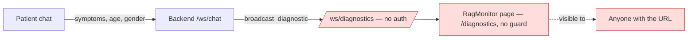

# TriagePlus — Pre-Mortem Risk Analysis

**Repo:** github.com/skanda-P/TriagePlus · **Snapshot reviewed:** commit `e2951d0`, 2026-07-02
**Method:** Tiger / Paper Tiger / Elephant pre-mortem (prospective hindsight)

## A note on method

A pre-mortem normally runs as a live, 60–90 minute session with 4–8 people: *"It's 14 days after launch, and we failed. Why?"* — silent generation, clustering, classification, then mitigation. There's no live session here, so this document is an adapted, solo pass: I read the actual code, commit history, and config, and classified what I found using the same Tiger / Paper Tiger / Elephant lens. Two consequences of that adaptation:

- **Tigers and Paper Tigers below are unusually well-evidenced** (file/line citations) because they come from reading the code rather than group intuition.
- **The Elephants are the ones visible from the outside** — patterns in commit messages, docs, and structure. The Elephants a real team would surface about *timeline pressure, funding, or "does anyone actually think this is ready"* can only come out in the room. I'd treat this document as a **pre-read for an actual live pre-mortem with the team** (and ideally a clinician), not a replacement for one.

**Assumptions made** (per the skill's "if the user says just draft it, state assumptions and proceed" rule):
1. The thing being stress-tested is **TriagePlus's first real-patient pilot** — nothing in the repo suggests a live deployment yet (everything is localhost-oriented), so "launch" here means the first time real patients use it, whenever that is.
2. Failure horizon is the standard **14 days post-launch**.
3. "Failure" is read broadly — a data leak, a missed emergency, or simply nobody trusting/using it all count.

---

## The scenario

It's two weeks after TriagePlus went live for real patients at a pilot site. It's been pulled. Maybe a patient's symptom conversation showed up somewhere it shouldn't have. Maybe someone described chest pain and the bot cheerfully asked a follow-up question instead of telling them to call emergency services. Maybe it just fell over under normal traffic. Working backward from that failure is the point of everything below.

## Executive summary

The codebase is a genuinely impressive amount of working product for ~48 hours of commits (2026-07-01 to 2026-07-02) by a 1–2 person team: a real FSM-driven chat flow, streaming responses, RAG over two FAISS indexes, and a doctor-portal shell. The risks below aren't a verdict on that effort — they're what's likely to bite if this goes in front of real patients as-is.

| Category | Count | Notes |
|---|---|---|
| 🐯 Tigers | 16 | 8 Launch-Blocking, 5 Fast-Follow, 3 Track |
| 📄 Paper Tigers | 3 | Named so the team doesn't burn cycles on them prematurely |
| 🐘 Elephants | 4 | Unspoken framing questions worth saying out loud |

The single biggest issue is **T5**: an unauthenticated WebSocket broadcasts every patient's raw symptom text and AI output in real time to anyone who connects. Fix that first, independent of anything else in this document.

---

## 🐯 Tigers — real, evidenced risks

### Patient safety & clinical reliability

**T1. Emergency detection fails open — Launch-Blocking**
`check_emergency_llm()` (`RAG/ml_training/gemini_inference.py:152-174`) is the *only* check for whether a message describes a life-threatening emergency, and it runs on a small local `llama3.2` model with zero deterministic backstop (no keyword net for "chest pain," "can't breathe," "unconscious," etc.). If the call throws for any reason — Ollama not running, timeout, malformed JSON, model crash — the `except` block logs it and returns `False`:
```python
except Exception as e:
    logger.error(f"Emergency LLM check failed: {e}")
    return False
```
That's the one place in this app where failing closed (assume emergency, show the banner, let the patient dismiss it) is clearly correct and failing open is clearly wrong. Worth noting the call site is *also* unguarded in `chat.py` — `check_emergency_llm(content)` runs before the FSM dispatch and outside the try/except that wraps the rest of the turn, so an exception here doesn't just mis-classify, it can drop the connection entirely.
*Mitigation: add a fast keyword/regex safety net that runs regardless of LLM health; fail closed on any exception; add a test that asserts the fallback path shows the emergency banner, not silence.*

**T2. Urgency score has no confidence-based safety margin — Launch-Blocking**
`infer_department_final()` (`gemini_inference.py:404-409`) falls back to "General Medicine" when confidence is low — a sensible safety net for *department*. There's no equivalent for **urgency**: a low-confidence call can still emit `urgency_score: 1` (green) with nothing pulling it toward caution. A confident wrong department is embarrassing; a confident-sounding *low* urgency on a serious complaint is the failure mode that actually hurts someone.
*Mitigation: when confidence or RAG match is low, floor the urgency score (or force an "insufficient information, please seek in-person evaluation" path) rather than trusting the raw number.*

**T3. No accuracy evaluation anywhere in the pipeline — Launch-Blocking**
Across all four scripts in `RAG/ml_training/` (966 lines), there's no precision/recall/F1/eval-set logic at all. The confidence threshold (`0.6`), the two RAG match thresholds (`0.35`, `0.3`), and `MAX_INTERACTIVE_TURNS = 6` are all real, safety-relevant constants with no visible tuning process behind them. `models/gemini_predictions.json` (540 stored predictions from 2026-06-29) is the closest thing to an eval artifact, but it has no ground-truth labels or scoring attached, and — see T9 — it's from a model the app no longer uses.
*Mitigation: build even a small labeled eval set (symptom → correct department/urgency) and report accuracy before trusting these thresholds with real patients.*

**T4. Safety-critical reasoning was quietly downgraded to a small local model — Launch-Blocking**
Emergency detection, slot extraction, and department/urgency assignment all now run on `llama3.2` via Ollama — a materially smaller, weaker model than the Gemini 2.5 Flash the product is still described as using (see T9). The code's own defensiveness is the evidence this is shaky: retry loops, `strict=False` JSON parsing to tolerate malformed output, markdown-fence stripping, and forced-completion turn caps. That's a lot of scaffolding around "make sure the model's output is usable," which is a reasonable thing to build but also a signal the underlying generation isn't reliable yet for the job it's doing.
*Mitigation: re-run whatever evaluation existed for the Gemini version against the Ollama version before treating them as equivalent.*

### Privacy & security

**T5. Unauthenticated real-time broadcast of patient data — Launch-Blocking**
`/api/v1/ws/diagnostics` (`chat.py:29-37`) accepts any connection, no auth, and `broadcast_diagnostic()` pushes every patient's raw query text, full LLM prompt (including age/gender), and raw model response to every connected client, for every turn of every session. `frontend/src/pages/RagMonitor.tsx` is a complete, polished UI for this feed, routed at `/diagnostics` with no guard in `App.tsx`:
```tsx
<Route path="/diagnostics" element={<RagMonitor />} />
```
Anyone who finds that URL sees a live feed of real patient symptom descriptions. This is the one item in this whole document to fix before anything else ships.


*Mitigation: authenticate this endpoint (it should require the same doctor/staff auth as the dashboard, at minimum), and don't broadcast raw patient text to a channel meant for engineering diagnostics — send de-identified or aggregated data instead. Handling health data like this is also the kind of thing that draws regulatory attention under whatever health-privacy law applies where you operate (HIPAA-style in the US, the DPDP Act in India, GDPR in the EU) — worth a legal/compliance read, not just an engineering fix.*

**T6. Doctor authentication is entirely mocked — Launch-Blocking (before the queue is wired up)**
```python
@router.post("/auth/doctor/login")
async def doctor_login(req: LoginRequest):
    return {"access_token": "dummy_token"}

@router.get("/doctors/me/queue")
async def get_doctor_queue():
    return []
```
`doctor_login` ignores `email`/`password` entirely and always succeeds; `get_doctor_queue` doesn't even read the `Authorization` header. The frontend (`DoctorLogin.tsx`, `DoctorDashboard.tsx`) does the right things — stores a token, sends it as a Bearer header, redirects on 401 — but there's nothing real on the other end. Today's blast radius is small only because the queue returns `[]` and "Start/End consultation" are `alert()` stubs. The risk is what happens if someone wires real patient-queue data into `get_doctor_queue` under demo pressure without circling back to fix auth first.
*Mitigation: treat this as a blocker for connecting any real data to these routes, not just a "nice to have" — implement real credential checks and token verification before the queue does anything but return `[]`.*

**T7. No rate limiting anywhere — Fast-Follow, Launch-Blocking if a pilot is public-facing**
Neither `/ws/chat/{session_id}` nor `/ws/diagnostics` nor the doctor endpoints have any rate limiting, CAPTCHA, or per-IP/per-session throttling (`requirements.txt` and `backend/` have no rate-limit dependency at all). Every message triggers at least one LLM call (see T16 on the emergency check running on every FSM step too). A public, unauthenticated WebSocket with an uncapped LLM call behind it is a straightforward cost/availability target.
*Mitigation: add basic per-IP/session throttling before any public pilot.*

**T8. Unbounded in-memory session store — Fast-Follow**
```python
_sessions: dict[str, dict] = {}
```
Confirmed by grep: this dict is populated (`chat.py:68-69`), read (79), and written back (285) — never deleted, popped, or expired anywhere in the file. Every WebSocket connection with a syntactically valid UUID adds an entry that lives until the process restarts. Combined with T7 (no rate limiting), this is a low-effort memory-exhaustion path, and even without abuse, it grows unbounded under normal use.
*Mitigation: add TTL-based eviction (e.g., drop sessions idle > N minutes) and a max-size guard.*

### Architecture & deployability

**T9. Product docs and UI describe a system that no longer exists — Launch-Blocking**
The README still says *"Powered by Gemini 2.5 Flash"* and instructs setting `GEMINI_API_KEY` in `backend/.env`. `requirements.txt` still lists `google-generativeai` ("legacy package"). All four `prompts/*.md` planning docs are written around Gemini. But the actual inference code (`gemini_inference.py`) runs entirely on local Ollama + `llama3.2` — the Gemini client was removed (*"Removed `_get_gemini_client()` entirely as Ollama runs as a background service"*). Neither the README nor the dedicated `prompts/04_Setup_Instructions.md` mentions Ollama or llama3.2 anywhere (confirmed by direct search — zero matches). The frontend didn't get the memo either: `RagMonitor.tsx` still labels a panel *"Raw Gemini Response"* and a latency stat *"Gemini API: {ms}"*.

Concretely, a new contributor following the README today would set an unused API key, never install Ollama, and get silent inference failures on every message with no clue why. This looks like a late, under-pressure swap (the commit history shows *"added local llama3.2 model"* near the end of the log) that never got propagated anywhere else.
*Mitigation: this is a half-hour documentation fix with an outsized payoff — update the README, setup instructions, requirements comment, and the RagMonitor labels to match reality, and make an explicit, written decision about which backend (Gemini or Ollama) is the intended one going forward.*

**T10. No coherent deployment path beyond localhost — Launch-Blocking**
`run.py` binds to `127.0.0.1` only; the README's alternate `uvicorn` command doesn't specify a host either. `frontend/vercel.json` deploys the frontend as a static SPA to Vercel — fine for the frontend, but there's no Dockerfile, Procfile, or any IaC for the backend, and the backend now needs a persistent process running Ollama with a loaded model plus two in-memory FAISS indexes and their metadata (tens of MB, loaded fully into memory on first request). That's a stateful, resource-heavy service that doesn't fit a serverless/static host at all, and nothing in the repo shows where it's meant to run. Worth confirming this has actually been deployed and load-tested somewhere before assuming it's launch-ready.
*Mitigation: pick a real hosting target for the backend (a VM or container host with enough RAM/CPU for Ollama + FAISS) and prove the full stack works there, not just on a laptop.*

**T11. Single-process, in-memory state blocks horizontal scaling — Fast-Follow**
`_sessions` and `_diagnostic_clients` are plain in-process Python state. Running more than one backend worker/instance (for scale or zero-downtime deploys) would silently split sessions across processes that don't share state, and any restart drops every active patient conversation with no recovery.
*Mitigation: move session state to something shared (Redis, a database) before scaling past one process.*

**T12. Page refresh mid-conversation desyncs frontend and backend — Fast-Follow**
`useSession.ts` persists the session ID in `sessionStorage`, so a refresh reconnects to the *same* backend session. But the frontend's Zustand chat store (`chatStore.ts`) has no persistence, so a refresh gives the patient a blank chat window while the backend still thinks they're mid-FSM (e.g., in `RECOMMENDING`, waiting for a yes/no). The patient's next message gets interpreted against that stale state with no visible context — e.g., typing a new symptom while the backend is only listening for "book" gets back "Let me know if you'd like to book an appointment," which will look broken to the patient.
*Mitigation: on reconnect, either replay the session's message history to the frontend, or restart the FSM state cleanly when the frontend has no local history.*

### Engineering process & quality

**T13. Zero automated tests, zero CI — Fast-Follow (treat as launch-blocking given the domain)**
No test files anywhere in the repo (backend or frontend), no `pytest`/`vitest`/`jest` config, no `.github/workflows` or any CI definition. For a chat FSM with 6+ states, an LLM-dependent emergency check, and JSON-parsing-from-a-model logic, this means every change is a manual, ad hoc verification — in a domain where a regression can mean a missed emergency rather than a broken button.
*Mitigation: start small — unit tests for the FSM transitions and the emergency-check fallback path would catch the two scariest regressions (T1, T12) cheaply.*

**T14. ~95MB of committed binary/data artifacts, inconsistent `.gitignore` — Track**
`RAG/faiss/index_b_meta.json` alone is 22MB; `medquad.jsonl` and `medquad.csv` (22MB each) are duplicate copies of the same public dataset. `.gitignore` excludes `*.json`/`*.jsonl` in `RAG/ml_training/data/` but not `*.csv` — and `medquad.jsonl` is tracked anyway, presumably committed before that rule existed (git doesn't retroactively untrack files). The FAISS-index exclusion lines are present but commented out, so the indexes are committed rather than rebuilt or stored via Git LFS. There's also a stray `gemini_inference.py.bak` checked into `RAG/ml_training/`. None of this breaks the app, but it makes every clone slow and every future `git gc` a chore.
*Mitigation: move large/regenerable artifacts to Git LFS or a build step, drop the duplicate CSV/JSONL, remove the `.bak` file, and align `.gitignore` with what's actually meant to be tracked.*

**T15. A prior FAISS corruption already needed a manual, non-portable recovery — Track/Fast-Follow**
`recover_faiss.py` hardcodes `Path(r"D:\BTech\hackathons\triageplus\triagePlus\RAG")` — one developer's Windows drive layout — and rebuilds Index A from source text plus a pre-existing `embeddings_a.npy`. Its mere existence is the interesting part: it implies the index/metadata already went out of sync with the underlying data once. As written, only the person who wrote it could run it again without editing the path first, which is a rough position to be in during an actual incident.
*Mitigation: parameterize the path (relative to the script, or via arg/env var), and consider whether the index-build step should be a repeatable pipeline rather than a one-off script.*

**T16. Smaller polish items — Track**
- Every FSM turn (including entering your name, age, gender, or phone number) triggers a full `check_emergency_llm` call — unnecessary LLM cost/latency on turns that can't possibly be a symptom description.
- `frontend/legacy/` (~28KB of plain HTML/JS/CSS) is dead code — confirmed unreferenced anywhere in the active `src/` tree — and could confuse a new contributor about which frontend is real.
- No `LICENSE` file at the repo root.
- `frontend/package.json` pins `@types/react-router-dom: ^5.3.3` alongside `react-router-dom: ^7.1.5` — v7 ships its own types, so the v5 types package is stale and could cause confusing type errors later.
- `backend/.env.example` doesn't exist (only `frontend/.env.example` does), so the README's setup step 3 has no template to copy from — moot right now anyway since `GEMINI_API_KEY` isn't used (T9).

---

## 📄 Paper Tigers — named so they don't distract from the real list

**PT1. "The scale won't hold up"**
There's no evidence of load at all yet (this is a pre-launch, 2-day-old codebase). The actual near-term ceiling is T7/T8 (no rate limiting, no session eviction) — fix those, and raw concurrency at pilot scale is unlikely to be the thing that breaks first. Load-testing for thousands of concurrent users is premature before the Launch-Blocking items above are closed.

**PT2. "An LLM can't be trusted for anything medical"**
This is a real category of concern, but the *specific*, evidenced version of it is already captured above (T1–T4: fail-open emergency detection, no confidence margin on urgency, no eval, an unvalidated model swap). Treating "AI is scary" as its own risk on top of those is double-counting; the fix is the same either way — validate the model's outputs, don't take "the model is the risk" as a reason to avoid doing that validation.

**PT3. "Patients won't trust or use an AI triage bot"**
Plausible, but nothing in the repo confirms or refutes it — it's a user-research question, not a code defect. Worth noting the UX work here is actually reasonably thoughtful (the `EmergencyBanner` uses `aria-live="assertive"`, an unmissable "Call 112 Now" link, and clear confidence/urgency labeling on recommendations) — the team has clearly thought about trust-building, so this reads more like an open question to validate with real users than a known gap.

---

## 🐘 Elephants — the things worth saying out loud

**E1. The pivot away from Gemini doesn't look like a decision — it looks like something that happened under pressure and never got revisited.**
Nothing in the repo says *why* the switch to a local model happened (cost? API quota during the build? latency?), and nothing indicates anyone went back to update the README, the setup docs, the requirements comment, or the UI copy afterward. Worth asking directly: was this a considered call, or a stopgap that's about to become permanent by default?

**E2. This is a hackathon build wearing a clinical product's branding.**
Two days, 15 commits, 1–2 people, a `prompts/` folder of literal AI build instructions, a `Problem_Statement_Summary.md` — every signal points to a hackathon entry, which is a genuinely fine thing to be. But "AI-powered medical triage assistant" is also the exact kind of claim that invites people to treat it as more validated than it is. Worth being explicit, internally and with any pilot partner, about which one this currently is.

**E3. Nobody is watching this in production yet.**
There's no error tracking or monitoring; exceptions are caught and turned into a generic "please rephrase" bubble with nothing persisted beyond a console log line. The one place that *does* show live inference detail — the diagnostics feed — is also T5, the biggest privacy hole in the app. Right now, if this misroutes a patient or misses an emergency in the field, the team finds out from a complaint, not a dashboard.

**E4. No clinician appears in this process anywhere.**
The department list, the urgency rubric, the emergency-detection prompt, and the disclaimer wording were all authored the same way the rest of the code was — by whoever wrote the prompt. That may be completely fine for a hackathon demo. Before real patients rely on it, it's worth having a clinician actually read and sign off on those specific artifacts.

---

## Risk registry

| ID | Risk | Category | Urgency |
|---|---|---|---|
| T1 | Emergency detection fails open on any error | Tiger | Launch-Blocking |
| T2 | No confidence-based safety margin on urgency score | Tiger | Launch-Blocking |
| T3 | No accuracy evaluation of triage decisions | Tiger | Launch-Blocking |
| T4 | Safety-critical reasoning downgraded to small local model, unvalidated | Tiger | Launch-Blocking |
| T5 | Unauthenticated real-time broadcast of patient data | Tiger | Launch-Blocking |
| T6 | Doctor auth fully mocked | Tiger | Launch-Blocking |
| T9 | Docs/UI describe a Gemini system that no longer exists | Tiger | Launch-Blocking |
| T10 | No coherent deployment path beyond localhost | Tiger | Launch-Blocking |
| T7 | No rate limiting anywhere | Tiger | Fast-Follow |
| T8 | Unbounded in-memory session store | Tiger | Fast-Follow |
| T11 | Single-process state blocks horizontal scaling | Tiger | Fast-Follow |
| T12 | Refresh mid-conversation desyncs frontend/backend | Tiger | Fast-Follow |
| T13 | Zero automated tests, zero CI | Tiger | Fast-Follow |
| T15 | Prior FAISS corruption needed hardcoded manual recovery | Tiger | Fast-Follow |
| T14 | ~95MB committed binaries, inconsistent .gitignore | Tiger | Track |
| T16 | Minor polish items (dead code, license, dep versions, extra LLM calls) | Tiger | Track |
| PT1 | "Scale won't hold up" | Paper Tiger | — |
| PT2 | "LLMs can't be trusted medically" (generic form) | Paper Tiger | — |
| PT3 | "Patients won't trust an AI bot" | Paper Tiger | — |
| E1 | Undocumented, possibly unreviewed Gemini→Ollama pivot | Elephant | — |
| E2 | Hackathon build, clinical branding | Elephant | — |
| E3 | No production observability | Elephant | — |
| E4 | No clinician in the loop | Elephant | — |

## Suggested next step

Fix **T5** regardless of anything else — it's a live privacy hole today, not a launch-time risk. After that, the natural order is roughly: close the other Launch-Blocking Tigers (T1, T2, T3, T4, T6, T9, T10), then run an actual live pre-mortem session with the full team — and ideally a clinician — using this document as the pre-read. That's the only way to get at the Elephants that a solo code review structurally can't see: timeline pressure, what "launch" actually means for this team, and whether everyone genuinely agrees this is ready for real patients.
